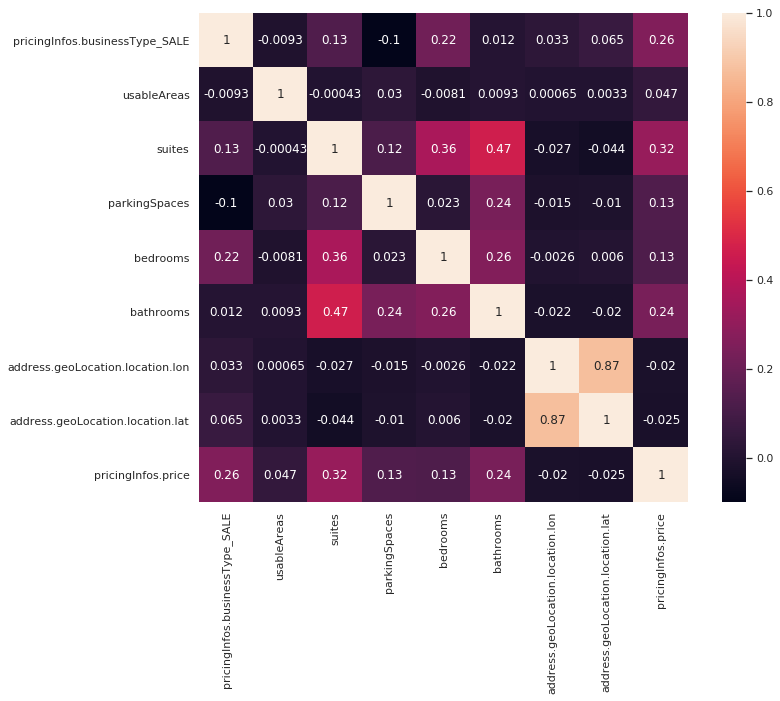

# ZAP Challenge

Neste projeto estão dois Jupyter Notebooks contendo todo o processo de construção do dataset e do modelo, e o arquivo de predições requerido .

O arquivo regression_training.ipynb contém o processo de treinamento dos modelos testados

O arquivo final_predictor.ipynb contém  o processo tratamento dos dados de teste e inferencia os resultados.

## Em quais bairros modelo performa melhor? Deixe claro como chegou a esse resultado.

Para esta verificação foi feita a predição dos preços das casas em cada bairro e medido o erro do modelo, os resultados são então ordenados de forma crescente pelo erro.

| Bairro                 | Erro     |
| ---------------------- | -------- |
| Parque Pereira         | 0.001697 |
| Cidade Vargas          | 0.002759 |
| Vila Mira              | 0.007480 |
| Jardim Maria Eugênia   | 0.007681 |
| Vila Uniao(Zona Norte) | 0.014263 |
| I Bibi                 | 0.017863 |
| Vl Bertioga            | 0.019412 |
| Jd Marajoara           | 0.026067 |
| Vila Aimore            | 0.027785 |
| Jd Guedala             | 0.030824 |

Para uma lista mais ampla procure a seção "Performance por bairro" no arquivo regression_training.ipynb e mude o parametro em [neighborhood_errors.head(10) ]

## Se você tivesse que estimar o valor dos imóveis com apenas 3 campos, quais seriam eles?

- suites

- princigInfos.businessType

- bathrooms

  

  Calculando a matriz de correlação das variaveis é possivel observar quais variaveis estão melhor correlacionadas com o preço do imóvel.

## Você utilizaria a métrica escolhida para seleção de modelo também para comunicar os resultados para usuários e stakeholders internos? Em caso negativo, qual outra métrica você utilizaria? Por quê?
​    A métrica utilizada, RMSE (Root Mean Square Error) é a mais intuitiva das metricas praticadas em regressões lineares, durante a comunicação bastaria deixar claro aos usuarios e stakeholders que este valor se mostra mais valioso quando proximo de zero

## Entre os clientes do Grupo ZAP temos pessoas que anunciam imóveis e pessoas que buscam imóveis. Como a sua solução poderia auxiliar cada tipo de cliente?

​    Anunciantes poderão prever o valor de seus imoveis com mais agilidade, dado que o processo de avaliação de um imovel não é algo tão rápido. Podem também estimar o valor do aluguel que pretendem cobrar, sem o medo de estar longe dos preços comumente praticados.
​    Compradores podem checar se os valores dos imoveis e dos alugueis estão em relação aos preços exercidos pelo mercado.
​    Um modelo treinado para este tipo de tarefa pode trazer mais clareza e agilidade para negociações imobiliarias.
